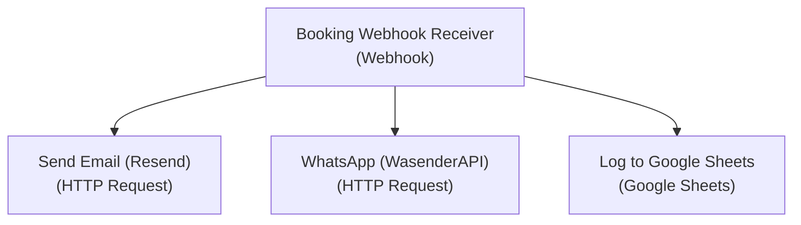

# n8n Production Workflow Setup

This document outlines the configuration, credentials, and deployment steps for the **Firstflight Booking Automation Workflow** in your n8n instance.

---

## 1. Workflow Architecture

As shown in the editor diagram, the production workflow consists of a single Webhook trigger mapped directly to three target channels (without an IF condition block):



---

## 2. Prerequisites & Credentials

Ensure you have your developer accounts and keys ready:

* **Google Sheets:** Client ID & Client Secret set up under Google account `mmaisolutions.pvt@gmail.com`.
* **Resend Email:** API key configured under `mmaisolutions.pvt@gmail.com`.
* **WasenderAPI WhatsApp:** API token configured under `akash@mindmastersai.services`.

---

## 3. Starting n8n in Docker

1. Create a `.env` file in your root workspace `c:\Users\HP\OneDrive\Desktop\flight_repo\firstflight-travels` with your credentials:
   ```env
   # n8n credentials
   N8N_BASIC_AUTH_ACTIVE=true
   N8N_BASIC_AUTH_USER=admin
   N8N_BASIC_AUTH_PASSWORD=admin

   # Service API Keys
   RESEND_API_KEY=re_your_resend_api_key
   WASENDER_API_KEY=6e388b8a96f6bea7f714d930f211fea7554038bbcc45727bc228c4e9a314c276
   GOOGLE_SHEETS_SPREADSHEET_ID=your_sheet_id
   ```

2. Start the n8n Docker container:
   ```powershell
   docker run -d --name n8n -p 5678:5678 --env-file .env -v n8n_data:/home/node/.n8n n8nio/n8n
   ```

3. Open `http://localhost:5678` in your browser and log in with your admin credentials.

---

## 4. Setup Credentials in n8n

### 4.1 Resend Credentials
1. Under **Credentials** in n8n, click **New Credential** and select **HTTP Header Auth**.
2. **Name of Credential:** `Authorization`
3. Add the following header entry:
   * **Header Name:** `Authorization`
   * **Header Value:** `Bearer <your_resend_api_key>` (e.g. `Bearer re_aEyQdvH7...`)

### 4.2 WasenderAPI Credentials
1. Under **Credentials**, click **New Credential** and select **HTTP Header Auth**.
2. **Name of Credential:** `Authorization` *(n8n allows sharing the same credential name across different endpoints, or you can isolate them by service)*
3. Add the following header entry:
   * **Header Name:** `Authorization`
   * **Header Value:** `Bearer 6e388b8a96f6bea7f714d930f211fea7554038bbcc45727bc228c4e9a314c276`

### 4.3 Google Sheets OAuth Credentials
1. Under **Credentials**, click **New Credential** and select **Google Sheets OAuth2 API**.
2. Select your Google account **`mmaisolutions.pvt@gmail.com`**.
3. Provide the **Client ID** and **Client Secret** created in your Google Cloud Console for this project.
4. Complete the OAuth flow to authorize n8n to append rows to your sheets.

---

## 5. Configure Workflow Nodes

### 5.1 Booking Webhook Receiver
* **Type:** Webhook
* **Path:** `firstflight-booking`
* **Method:** `POST`

### 5.2 Send Email (Resend)
* **Type:** HTTP Request
* **URL:** `https://api.resend.com/emails`
* **Method:** `POST`
* **Credential:** `Authorization` (HTTP Header Auth)
* **JSON Body:** *Refer to the resend JSON snippet in walkthrough.md*

### 5.3 WhatsApp (WasenderAPI)
* **Type:** HTTP Request
* **URL:** `https://wasenderapi.com/api/send-message`
* **Method:** `POST`
* **Credential:** `Authorization` (HTTP Header Auth)
* **JSON Body:** 
  ```json
  {
    "to": "{{ $json.phone }}",
    "text": "Hi {{ $json.name }},\n\nYour Firstflight Booking is CONFIRMED!\n\nItem: {{ $json.itemData?.name || 'Booking' }}\nPrice: INR {{ $json.itemData?.price_inr || '0' }}\nPDF Ticket URL: {{ $json.pdf_url }}\n\nWish you a safe journey!"
  }
  ```

### 5.4 Log to Google Sheets
* **Type:** Google Sheets
* **Operation:** `Append Row`
* **Credential:** `Google Sheets OAuth2 API`
* **Document:** `Firstflight Bookings`
* **Sheet:** `Bookings`
* **Mapping Columns:** Map the columns manually using webhook expressions.

---

## 6. How to Test

Execute this test trigger request in Postman or via PowerShell CLI:

```powershell
curl -X POST http://localhost:5678/webhook/firstflight-booking \
  -H "Content-Type: application/json" \
  -d '{
    "userId": "usr_test123",
    "name": "Kavya Bhardwaj",
    "email": "kbvirgonaut2004@gmail.com",
    "phone": "+919084049141",
    "itemType": "flight",
    "itemData": {
      "name": "Air India AI-802",
      "price_inr": 8500,
      "fromDate": "2026-07-22",
      "toDate": "2026-07-29"
    },
    "pdf_url": "https://firstflight-tickets.s3.amazonaws.com/ticket_123.pdf"
  }'
```
